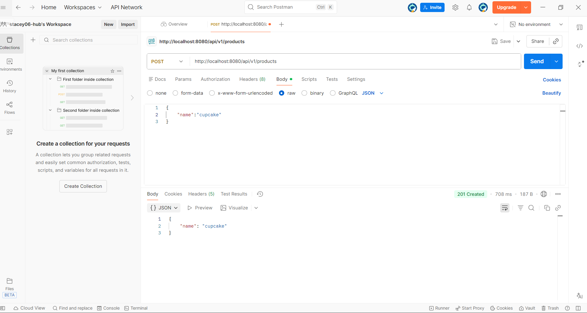
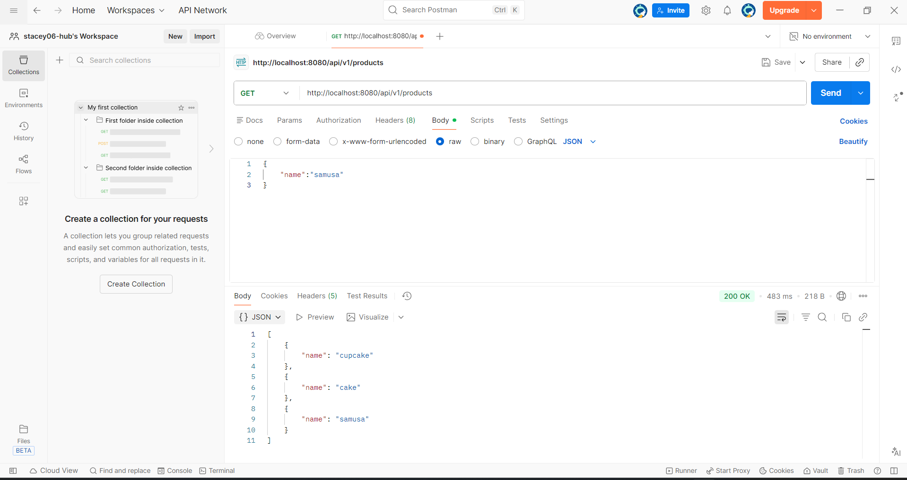
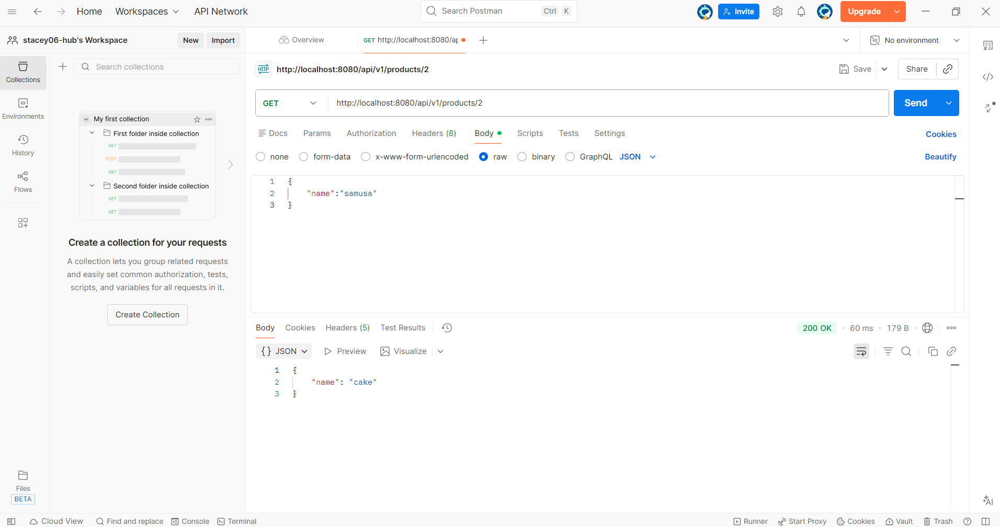
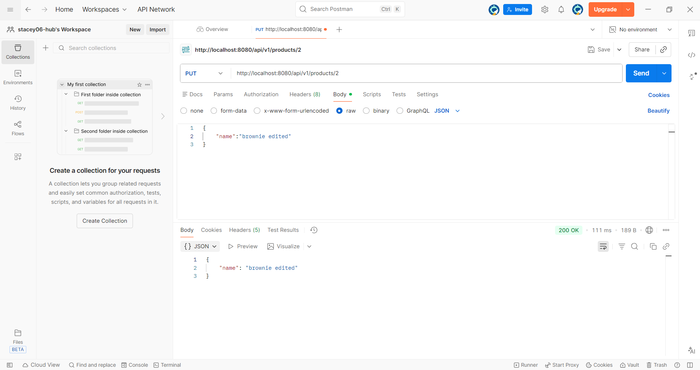
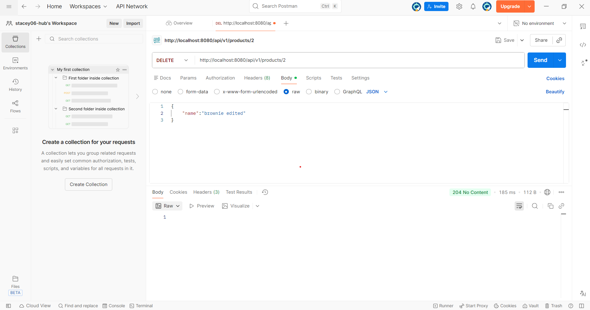
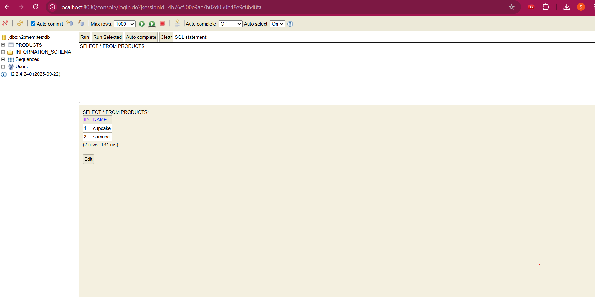

# Project 2 — REST API (Spring Boot)

A simple **backend-only** REST service built with Spring Boot.  
The goal of this project is to practice: **REST endpoints, layered architecture, mapping entity, database usage (H2), Swagger/OpenAPI and exception handling**.

---

##  Tech Stack

- **Java** 17+
- **Spring Boot** (Spring Web, Spring Data JPA, DevTools)
- **H2 Database** (in-memory)
- **Swagger / OpenAPI** (springdoc)
- Tools for testing: **Browser /  Postman**

## 🌐 REST Endpoints


### ➕ Create product
Adds a new product to the database.
> Screenshot: 

---
### 2. Find All Products (GET)

Returns a list of all products stored in the database.


> Screenshot:

### 3. Find Product by ID (GET)

Retrieves a product by its unique identifier.

> Screenshot:
---
### 4. Update Product (PUT)
Update Product by id in database.


> Screenshot: *

### 5. Delete Product (DELETE)
Delete Product from database.


> Screenshot: *

## 🗄 Database Management (H2 Console)

The project uses an **H2 In-Memory Database** for data storage and testing.

* **H2 Console URL**

  ```
  http://localhost:8080/console
  ```

* **JDBC URL**

  ```
  jdbc:h2:mem:testdb
  ```

> Screenshot of Database working: 